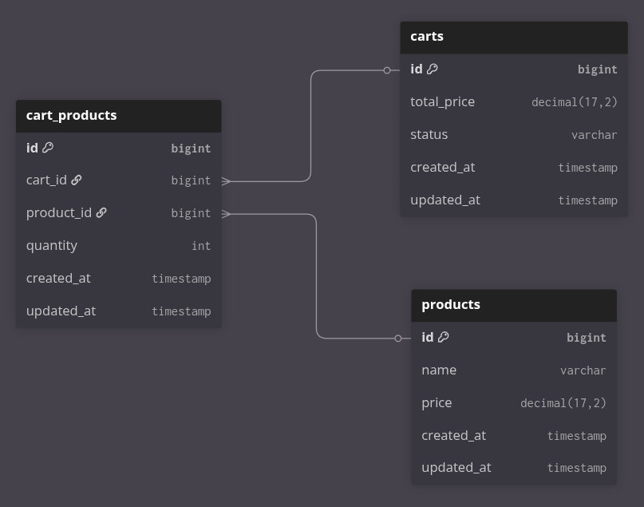

# Estrutura do Banco de Dados – Carrinho de Compras

Este banco de dados foi modelado para representar um sistema simples de **carrinho de compras**.

## Tabelas

### **carts** (carrinho de compra)  
Representa cada carrinho criado por um usuário/sessão.  
**Campos principais:**  
- `id`: identificador único do carrinho  
- `total_price`: valor total dos produtos no carrinho  
- `status`: estado do carrinho (ex.: aberto, abandonado, finalizado)  
- `last_interaction_at` data da última interação como carrinho
- `created_at` / `updated_at`: controle de criação e atualização  

---

### **products** (produtos)  
Armazena os produtos disponíveis para compra.  
**Campos principais:**  
- `id`: identificador único do produto  
- `name`: nome do produto  
- `price`: preço unitário do produto  
- `created_at` / `updated_at`: controle de criação e atualização  

---

### **cart_products** (tabela de ligação)  
Tabela de associação entre **carts** e **products**, permitindo o relacionamento *muitos-para-muitos*.  
**Campos principais:**  
- `id`: identificador único da ligação  
- `cart_id`: referência ao carrinho  
- `product_id`: referência ao produto  
- `quantity`: quantidade de um produto específico no carrinho  
- `created_at` / `updated_at`: controle de criação e atualização  

---

## Relacionamentos
- Um **carrinho (cart)** pode conter vários **produtos (products)**.  
- Um **produto (product)** pode estar em vários **carrinhos (carts)**.  
- A tabela **cart_products** faz essa ligação, armazenando também a **quantidade** de cada produto em cada carrinho.  

---

## Diagrama

Exemplo visual do modelo:

---
